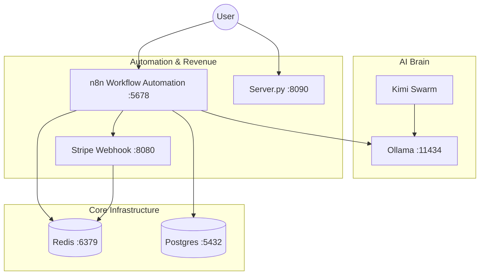

# Service Map

```mermaid
graph TD
    User((User))
    
    subgraph "Core Infrastructure"
        Redis[(Redis :6379)]
        Postgres[(Postgres :5432)]
    end
    
    subgraph "AI Brain"
        Ollama[Ollama :11434]
        Kimi[Kimi Swarm] --> Ollama
    end
    
    subgraph "Automation & Revenue"
        n8n[n8n Workflow Automation :5678]
        StripeVH[Stripe Webhook :8080]
        ServerPy[Server.py :8090]
    end
    
    User --> n8n
    User --> ServerPy
    
    n8n --> Redis
    n8n --> Postgres
    n8n --> Ollama
    n8n --> StripeVH
    
    StripeVH --> Redis
```
